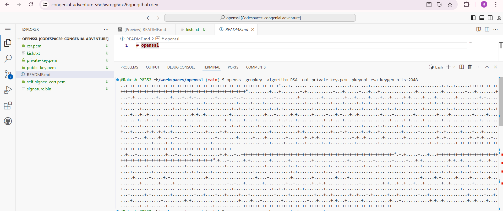
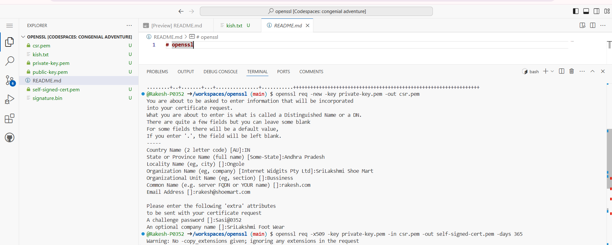
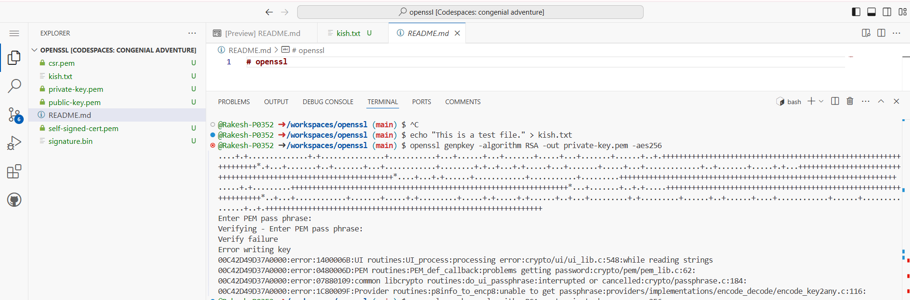
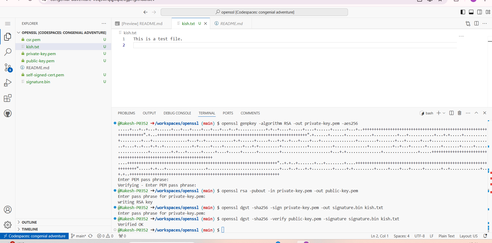

# openssl

 
 
 

# -> What is the purpose of generating a private key?

A private key is used to sign the data. This key must be kept secure and confidential.
  
# -> What is a Certificate Signing Request (CSR)?

A CSR is a file sent to a Certificate Authority (CA) to request a digital certificate. It contains the public key and information like name and organization.

# -> What happens when you sign a file?

Signing creates a digital signature. It proves the file is authentic and hasn’t been changed.

# -> How is a digital signature verified?

The public key is used to check the signature and ensure the file is original and not altered.

# -> What does Verified OK mean?

It means the signature matches the file, and the file is authentic and hasn’t been changed.

